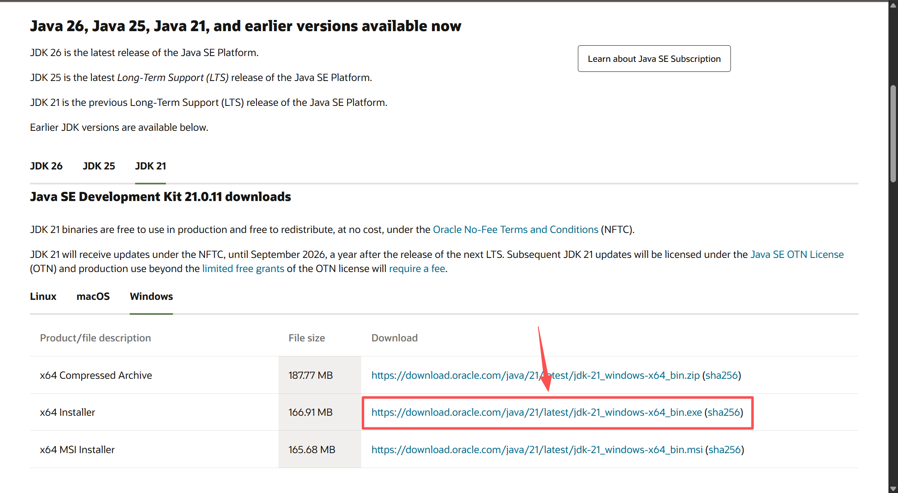
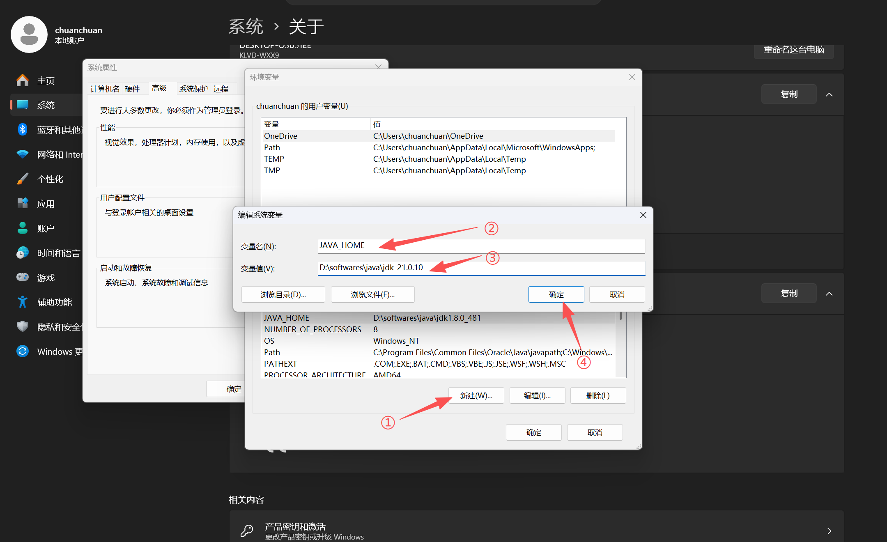
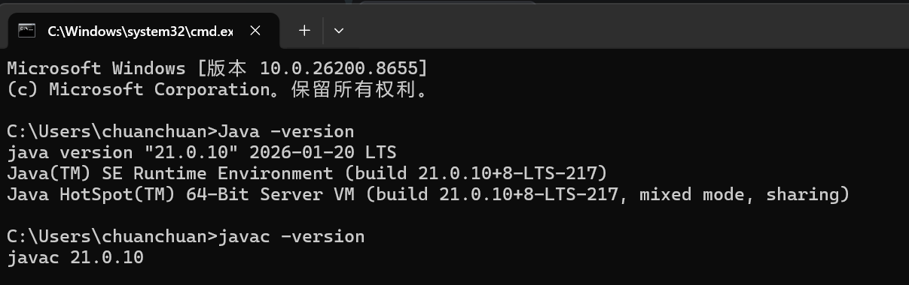
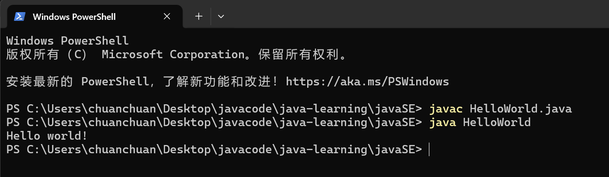

# Java 概述与入门指南

## 目录
1. [计算机基础知识](#1-计算机基础知识)
2. [Java 语言简介](#2-java-语言简介)
3. [JDK 下载与安装](#3-jdk-下载与安装)
4. [环境变量配置](#4-环境变量配置)
5. [第一个 Java 程序](#5-第一个-java-程序)
6. [常用开发工具](#6-常用开发工具)

---

## 1. 计算机基础知识

### 1.1 什么是程序
程序是一组计算机能够识别和执行的指令集合，用于完成特定的目的。简单说，它就是告诉计算机“做什么”和“怎么做”的一系列步骤。
 
### 1.2 编程语言分类
- **机器语言**：由 0 和 1 组成的二进制代码，计算机可直接执行。
- **汇编语言**：用助记符代替机器指令，需要汇编器翻译。
- **高级语言**：接近人类自然语言，易读写，如 Java、Python、C++。需编译或解释后运行。

### 1.3 编译与解释
- **编译**：将源代码一次性整体翻译成目标代码（如机器码），生成可执行文件，执行速度快。典型语言：C、C++。
- **解释**：逐行翻译并执行源代码，不生成独立可执行文件，灵活但执行较慢。典型语言：Python、JavaScript。
- **Java 的方式**：先编译成字节码（.class），再由 JVM 解释执行（或即时编译 JIT），兼具跨平台和高性能。

### 1.4 字节码与 JVM
- **字节码（Bytecode）**：Java 源文件（.java）经编译器编译后生成 .class 文件，内容即字节码。
- **JVM（Java Virtual Machine）**：Java 虚拟机，是运行字节码的抽象计算机。不同操作系统有各自实现的 JVM，从而实现“一次编译，到处运行”。

### 1.5 软件开发基本流程
```
需求分析 → 设计 → 编码 → 测试 → 部署与维护
```

---

## 2. Java 语言简介

### 2.1 Java 的诞生
Java 由 Sun Microsystems 公司于 1995 年正式推出，创始人 James Gosling。现属于 Oracle 公司。

### 2.2 Java 的特点
- **面向对象**：以类、对象、封装、继承、多态为核心。
- **跨平台**：通过 JVM 屏蔽底层差异。
- **健壮性**：强类型、自动垃圾回收、异常处理机制。
- **安全性**：无指针、字节码校验、安全沙箱。
- **多线程**：语言级别支持并发编程。
- **丰富的生态**：庞大标准库和第三方框架。

### 2.3 Java 三大体系
- **Java SE（Standard Edition）**：标准版，核心基础，包含基本语法、API、桌面开发等。
- **Java EE（Enterprise Edition）**：企业版，用于大型分布式网络应用。
- **Java ME（Micro Edition）**：微型版，用于嵌入式设备（现已较少使用）。

### 2.4 JDK、JRE、JVM 的关系
- **JVM**：执行字节码的核心。
- **JRE（Java Runtime Environment）**：包含 JVM + 运行所需的核心类库。运行 Java 程序只需要 JRE。
- **JDK（Java Development Kit）**：包含 JRE + 开发工具（编译器 javac、调试器等）。开发者必须安装 JDK。

三者包含关系：**JDK ⊃ JRE ⊃ JVM**

---

## 3. JDK 下载与安装

### 3.1 下载 JDK
Oracle 官网：https://www.oracle.com/java/technologies/downloads/
推荐下载 **JDK 17（LTS）** 或 **JDK 21（LTS）**，长期支持版本更稳定。

以 Windows 安装 JDK 21 为例：
- 选择对应系统版本（如 Windows x64 Installer）。
- 同意协议并下载。


### 3.2 Windows 安装步骤
1. 双击下载的安装包，点击 **Next**。
2. 可选修改安装路径（建议修改默认路径，建一个开发类软件专用的文件夹）。
3. 等待安装完成，直接关闭即可。

---

## 4. 环境变量配置

### 4.1 为何需要配置环境变量
操作系统通过环境变量 `PATH` 查找可执行程序。配置后可在任意目录下直接使用 `java`、`javac` 等命令。通常还需设置 `JAVA_HOME` 方便其他工具（如 Maven、Tomcat）定位 JDK。

### 4.2 Windows 配置
1. 找到 JDK 安装目录。
2. **设置 → 系统 → 关于 → 高级系统设置 → 环境变量**。

3. 新建系统变量：
    - 变量名：`JAVA_HOME`
    - 变量值：`C:\Program Files\Java\jdk-21`（JDK安装目录）

4. 编辑系统变量 `Path`，**新增**一条：`%JAVA_HOME%\bin`
5. 确定保存。


### 4.3 验证安装
按下 `Win + R`，输入 `cmd` 回车打开命令提示符，输入：
```bash
java -version
javac -version
```
若正确显示版本信息，则安装配置成功。

---
#### 4.4 JDK的安装目录介绍

| 目录名称    | 说明                                     |
|---------|----------------------------------------|
| bin     | 该路径下存放了JDK的各种工具命令。例如javac和java就放在这个目录。 |
| conf    | 该路径下存放了JDK的相关配置文件。                     |
| include | 该路径下存放了一些平台特定的头文件。                     |
| jmods   | 该路径下存放了JDK的各种模块。                       |
| legal   | 该路径下存放了JDK各模块的授权文档。                    |
| lib     | 该路径下存放了JDK工具的一些补充JAR包。                 |
## 5. 第一个 Java 程序

### 5.1 编写源代码
用任意文本编辑器创建文件 `HelloWorld.java`，内容如下：
> 注意显示扩展名，不要变成 HelloWorld.java.txt
```java
public class HelloWorld {
    public static void main(String[] args) {
        System.out.println("Hello, Java!");
    }
}
```
**注意**：文件名必须与 `public class` 后的类名完全一致（包括大小写）。

### 5.2 编译与运行
在文件所在目录打开命令行，执行：
```bash
javac HelloWorld.java    # 编译，生成 HelloWorld.class
java HelloWorld          # 运行，注意不能加 .class
```
如果输出 `Hello, Java!`，恭喜你成功入门！

### 5.3 程序结构解析
- `public class HelloWorld`：定义一个公开类。
- `public static void main(String[] args)`：程序入口，固定写法。
- `System.out.println(...)`：标准输出方法，打印并换行。

---

## 6. 常用开发工具

### 6.1 文本编辑器
- Visual Studio Code（免费，轻量，需装 Java 扩展包）
- Sublime Text、Notepad++ 等

### 6.2 集成开发环境（IDE）
- **IntelliJ IDEA**（强烈推荐）：社区版免费，智能提示强大。
- **Eclipse**：经典开源 IDE，插件丰富。
- **NetBeans**：官方支持，适合初学者。

安装 IDE 后可新建 Java 项目直接编写、运行，IDE 会自动使用系统中配置的 JDK。

---

## 总结
本篇涵盖了从计算机基础到 JDK 安装、环境配置以及第一个 Java 程序运行的完整流程。掌握这些内容是开启 Java 学习之路的必要基础。接下来可以继续学习 Java 基本语法、面向对象编程等核心内容。