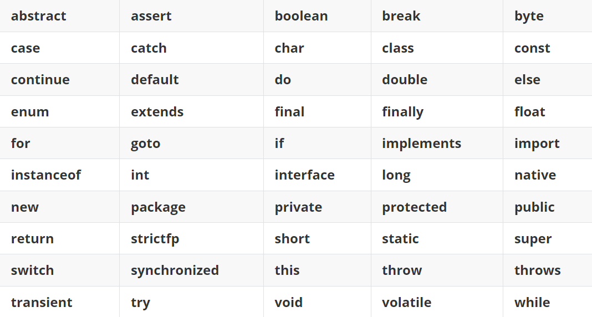

# Java 基础语法

## 目录
1. [注释](#1-注释)
2. [标识符与关键字](#2-标识符与关键字)
3. [数据类型](#3-数据类型)
4. [变量与常量](#4-变量与常量)
5. [基本的输入与输出](#5-基本的输入与输出)
---

## 1. 注释

注释用于解释代码，`不会被编译执行`。合理使用注释能提高代码可读性，但应避免注释过于琐碎或与代码逻辑不符。
  
Java中的注释分为三种：
```java
// 单行注释
// 当注释的内容比较少，一行就写完了，可以用单行注释。

/*
   多行注释
   可跨行
   如果注释的内容比较多，需要写在多行，那么可以使用多行注释。
*/

/**
 * 文档注释（可被 javadoc 工具提取生成 API 文档）
 * @author 作者名
 * @version 1.0
 */
```

> 注释的内容不会参与编译和运行的，仅仅是对代码的解释说明而已。
所以，不管在注释当中写什么内容，都不会影响代码运行的结果。

---

## 2. 标识符与关键字

### 2.1 标识符
标识符是程序员为类、方法、变量等命名的记号。

`硬性要求：`
- 由字母、数字、下划线 `_`、美元符 `$` 组成。
- 不能以数字开头。
- 区分大小写。
- 不能使用关键字。

`命名规范（非强制但必须遵守）：`
- 类名、接口名：大驼峰
  - 如果是一个单词，那么首字母大写。比如：Demo、Test。
  - 如果是多个单词，那么每一个单词首字母都需要大写。比如：HelloWorld
- 方法、变量名：小驼峰 
  - 如果是一个单词，那么全部小写，比如：name
  - 如果是多个单词，那么从第二个单词开始，首字母大写，比如：firstName、maxAge `  
- 常量：全大写下划线 `MAX_VALUE`
- 包名：全小写 `com.example`

### 2.2 关键字
关键字是 Java 预定义的、有特殊用途的单词，如 `class`、`public`、`static`、`void`、`int` 等，不能用做标识符。
关键字很多，不用刻意去记。

> 注意：goto 和 const 是保留字，但目前未被使用，也不能作为标识符。


---

## 3. 数据类型
Java 是强类型语言，每个变量必须声明类型。分为两大类：`基本数据类型`和`引用数据类型`。

### 3.1 基本数据类型（8 种）
- 整数类型（int、long、short、byte）
- 浮点数类型（double、float）
- 字符类型（char）
- 布尔类型（boolean）

| 类型      | 大小   | 范围                      | 默认值      | 示例                     |
|---------|------|-------------------------|----------|------------------------|
| byte    | 1 字节 | -128 ~ 127              | 0        | `byte b = 10;`         |
| short   | 2 字节 | -32768 ~ 32767          | 0        | `short s = 1000;`      |
| int     | 4 字节 | -2³¹ ~ 2³¹-1            | 0        | `int i = 100000;`      |
| long    | 8 字节 | -2⁶³ ~ 2⁶³-1            | 0L       | `long l = 100000L;`    |
| float   | 4 字节 | 约 ±3.4E-38 ~ ±3.4E+38   | 0.0f     | `float f = 3.14f;`     |
| double  | 8 字节 | 约 ±1.7E-308 ~ ±1.7E+308 | 0.0d     | `double d = 3.14159;`  |
| char    | 2 字节 | 0 ~ 65535 (Unicode)     | '\u0000' | `char c = 'A';`        |
| boolean | 1 位* | true / false            | false    | `boolean flag = true;` |

**需要特别注意：**
- 对于 long 类型的字面量，需要在数字后加 L（推荐大写），如 long num = 10000000000L;。
- 对于 float 类型的字面量，必须在数字后加 f 或 F，如 float pi = 3.14f;。小数默认是 double 类型，不加 f 会编译错误。
- char 表示单个字符，使用单引号括起，可以存储一个汉字（如 '中'），底层是 Unicode 码值。
- boolean 只有 true 和 false 两个值，不能与 0 或非 0 相互转换（与 C 语言不同）。

### 3.2 引用数据类型
- 数组（array）
- 类（class）
- 接口（interface）
- 字符串（String）属于类，是引用类型。

引用类型默认值为 `null`。

---

## 4. 变量与常量

### 4.1 变量声明与初始化
- **声明**：定义变量名，不分配内存空间。
- **赋值**：给变量赋值，分配内存空间。
- **声明并初始化**：同时完成声明和赋值。
```java
public class VariableDemo{
  public static void main(String[] args){
    int age;           // 声明
    age = 18;          // 赋值
    double pi = 3.14;  // 声明并初始化

    //可以在一行声明多个同类型变量（不推荐）：
    int a, b, c;
    int x = 1, y = 2;
  }
}
```

### 4.2 变量的分类（按作用域）
> 成员变量有默认值，但局部变量必须显式初始化
- **局部变量**：定义在方法、构造器或代码块内部，只在声明它的块内有效。使用时必须显式初始化，没有默认值。
- **成员变量**（实例变量）：定义在类中、方法之外。属于对象的属性，随对象创建而存在，有默认值（如 `int` 默认 0，引用类型默认 `null`）。
- **类变量**（静态变量）：使用 `static` 修饰，属于类本身而非某个对象，在类加载时初始化，所有对象共享。

### 4.3 常量
使用 `final` 修饰，值不可改变。通常配合 `static` 定义类常量。习惯上常量名全大写，并用下划线分隔单词。
```java
final double PI = 3.14159;
static final int MAX_SIZE = 100;
```
也可以结合 static 定义类常量，使其成为类的共享常量：
```java
public static final String APP_NAME = "MyApplication";
```
---

## 5. 基本的输入与输出

虽然输入输出不属于纯粹的语法范畴，但它们是编写可运行 Java 程序必备的基础操作。

### 5.1 输出
使用 `System.out` 对象提供的方法：
- `print()`：输出内容，不换行。
- `println()`：输出内容，并自动换行。
- `printf()`：格式化输出，占位符如 `%d`（整数）、`%f`（浮点）、`%s`（字符串）、`%n`（换行）。

```java
System.out.print("Hello ");
System.out.println("World");   // 打印 "Hello World" 后换行
System.out.printf("年龄: %d, 身高: %.2f%n", 20, 1.75);
```

### 5.2 输入
通过 `Scanner` 类从控制台读取用户输入（位于 `java.util` 包）。

步骤：
1. 导入 `Scanner`：`import java.util.Scanner;`
2. 创建 `Scanner` 对象：`Scanner sc = new Scanner(System.in);`
3. 调用方法读取数据：
  - `nextLine()`：读取一整行字符串（包含空格）。
  - `next()`：读取一个单词（遇到空格或回车结束）。
  - `nextInt()`：读取一个 `int` 整数。
  - `nextDouble()`：读取一个 `double` 浮点数。
4. 使用完毕可调用 `sc.close();` 释放资源（不强制，但养成好习惯）。

```java
import java.util.Scanner;

public class InputDemo {
    public static void main(String[] args) {
        Scanner scanner = new Scanner(System.in);
        System.out.print("请输入你的名字：");
        String name = scanner.nextLine();
        System.out.print("请输入你的年龄：");
        int age = scanner.nextInt();
        System.out.println(name + "，你明年将是 " + (age + 1) + " 岁。");
        scanner.close();
    }
}
```

> **注意**：当 `nextInt()`、`nextDouble()` 等与 `nextLine()` 混用时，要小心换行符残留的问题，通常可在数字输入后加一个额外的 `scanner.nextLine()` 来消耗掉换行符。

---

## 总结
以上内容覆盖了 Java 最基本的语法要素：注释、标识符、数据类型、变量、常量、类型转换以及简单的输入输出。它们是书写任何 Java 程序都离不开的基石。把这些元素练熟之后，再学习运算符、流程控制、数组和方法等内容就会水到渠成。